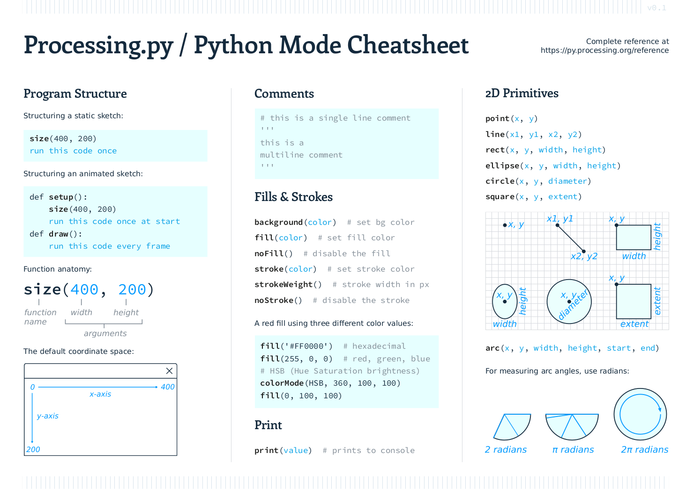
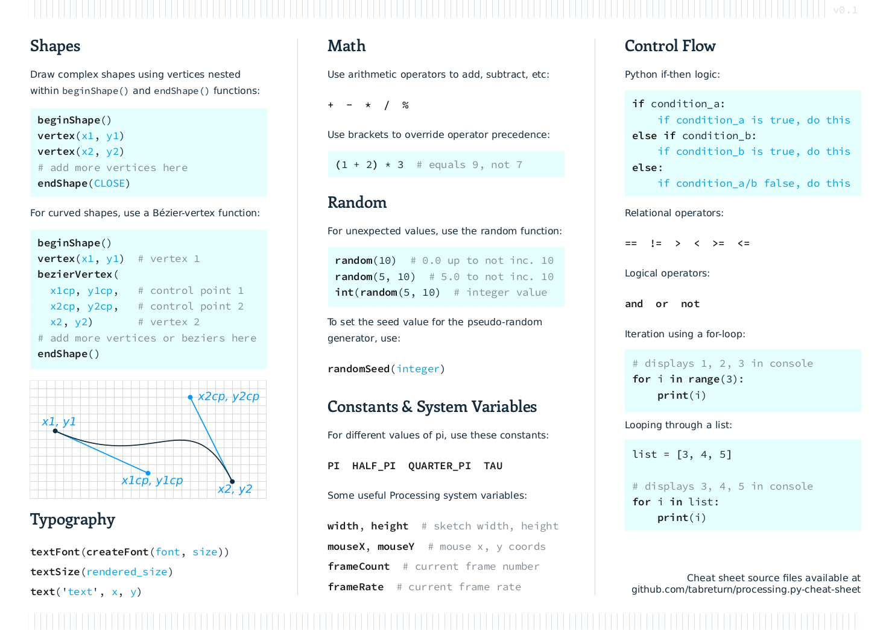

# Processing.py Cheat Sheet

*A Processing Python Mode / Processing.py cheat sheet for beginners*

**[Download cheatsheet (p.py_cc.pdf)](https://raw.githubusercontent.com/tabreturn/processing.py-cheat-sheet/master/p.py_cc.pdf)**

*page 1*
  
*page 2*

Designed with [Scribus](https://www.scribus.net/) and [Inkscape](https://inkscape.org/)  
Fonts: [DejaVu Sans](https://dejavu-fonts.github.io/), [Enriqueta](https://fonts.google.com/specimen/Enriqueta), [Source Code Pro](https://fonts.google.com/specimen/Source+Code+Pro)

## More Python Mode Resources

Resources for teaching artists, designers, and architects to code:

* https://github.com/villares/Resources-for-teaching-programming

Java Mode Processing and p5.js cheat sheets:

* https://bmoren.github.io/p5js-cheat-sheet/
* https://cdn.sparkfun.com/assets/6/3/f/e/3/Processing_Cheatsheet_Update.pdf
* https://www.cs.bham.ac.uk/~cxp291/ri/processing_cheat_sheet_english.pdf

A plain-old, Processing-less beginner Python cheat sheet:

* https://github.com/ehmatthes/pcc/blob/master/cheat_sheets/beginners_python_cheat_sheet_pcc.pdf

## Potential Additions

*Perhaps a simple 1- or 2-pager works best. Once the user outgrows this cheat sheet, the [official Python Mode reference](https://py.processing.org/reference) is probably more useful than a cheat sheet with several more pages.*

- [ ] strings
- [ ] slice notation
- [x] conditional statements 
- [x] iteration
- [x] random
- [x] frames
- [ ] transformation
- [ ] date & time
- [ ] lists
- [ ] external data
- [ ] dictionaries
- [ ] functions
- [ ] trig
- [ ] objects
- [ ] vectors
- [ ] interaction
- [x] constants

